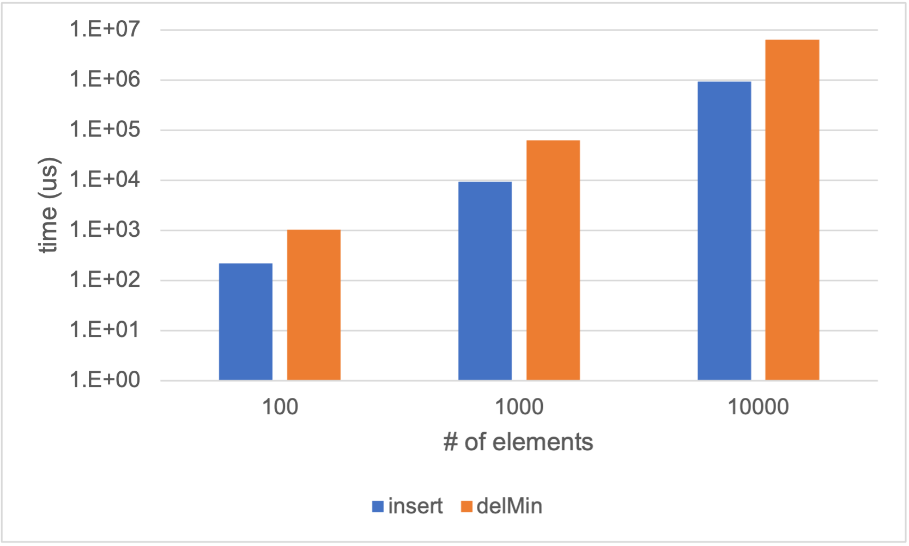
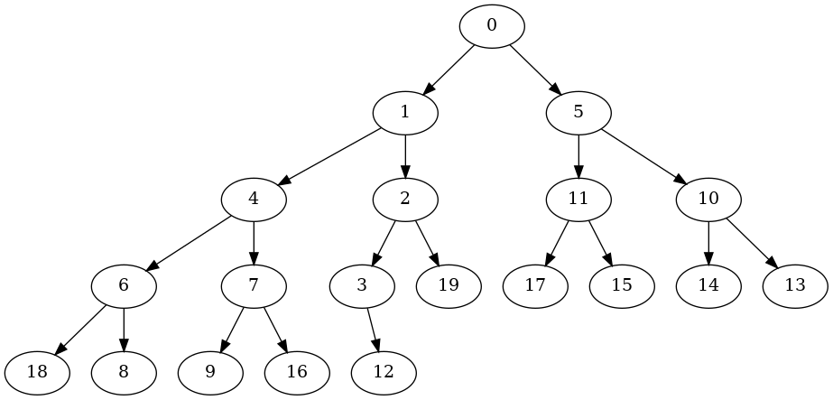

# Answer to questions
1. The BinaryTree class is built based on a linked list. To obtain a node's parent and child node, it first calculates the corresponding node index, and perform a traversal from the list head to the target node using the function get_nth.
2. 
    - insert: the insert function first appends the new node to the end of the list, and then performs the maintenance. It repeatedly compares the current node and its parent node. If the value of current node is larger than its parent node, the two nodes are swapped, otherwise the process is terminated.
    - delMin: it first handles a corner case when the pq is empty, and returns None in this case. Otherwise, it acquires the minimum value from the tree root. It then replaces tree root with the last node in the tree, and reduces the number of nodes by 1. Then it performs the maintenance to ensure that a node must have its value smaller than both its child nodes (if exists). The maintenance begins from the root node, and it is swapped with its smaller child if the condition does not hold. It repeatedly checks and swaps downwards.
3. 
   - insert: O(n log n). The loop in the insert function will execute at most log n times (tree depth), and each time it gets a parent node given an index. Since the tree is implemented using linked list, getting a node via the index takes O(n) times. Therefore, the overall complexity for insert is O(n log n).
   - delMin: O(n log n). The loop in the delMin function will execute at most log n times (tree depth), and each time it gets the left and right child nodes given an index. Since the tree is implemented using linked list, getting a node via the index takes O(n) times. Therefore, the overall complexity for delMin is O(n log n).
4. I test the insert and delMin performance with a list of 100, 1000, 10000 numbers. It first inserts all the numbers, and then deletes them one by one. The result is shown below (y axis is logarithmic).

5. 